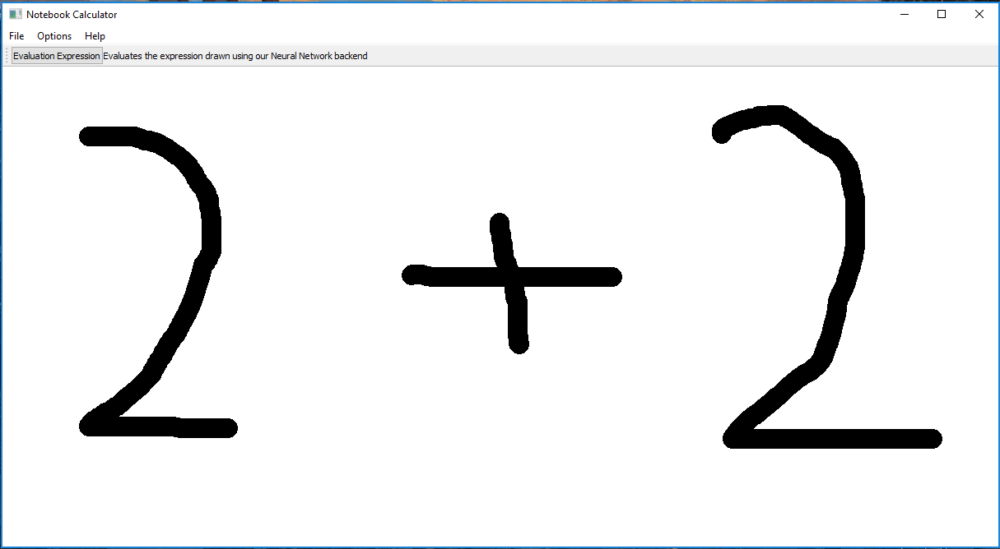

# calcAI

## Description
calcAI is a desktop app that includes a simple made with pyqt5. We let users draw an expression, such as the one shown in the image
above, and convert the image into a mathmatical expression in python. We accomplish this using a convolutional neural network to classify
each character in the image by dividing the image into smaller sub-images and appyling the CNN on those images. This is accomplished by
`splitting.py`. In `CNN.py`, we created a class that trains the neural network on images in `/TrainingSet` and then create an h5 file to store
the model represntation. Additionally, we used a test set to measure the performance of the CNN and adjust hyperparameters to obtain more
accurate classifications. After drawing the image and clicking on the "Evaluate Expression" button, the terminal displays the output of the
expression. If a user drew "2 + 2" the program would print "4" and similarily for other basic mathematical operations.

## How to use
Do the following steps:
-  Clone the repository
- Download all the dependencies
- Run the command `python gui.py`
- Draw an image
- Click on "Evaluate expression"

## External Dependencies
- Keras
- Numpy
- PIL
- Pickle
- Gzip
- matplotlib
- PyQt5

## Authors
- Frank Rodriguez [@frodr33](https://github.com/frodr33)
- Alisha Mithal
- Mattew Coufal
- Nicolas Barone

## NOTE
Commits have not carried over from the private cornell repository. This is because large files are includded
in the repositories history that prevented me from mirroring and uploading it while saving all commits

